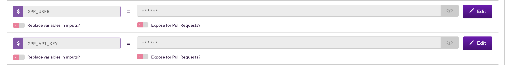
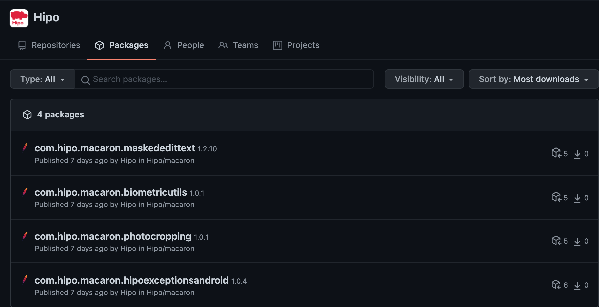
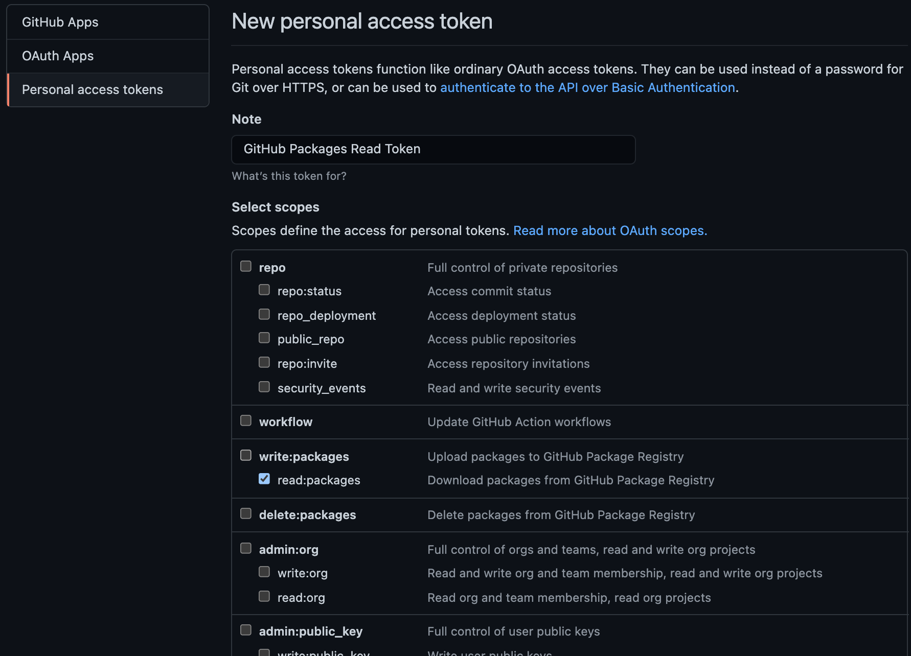

### Publishing library to GitHub Packages

Firstly we should take GitHub Personal Access Token for publishing our library to GitHub Packages.
It has to have `packages:read` and `packages:write` permissions.

####How do we get this token?

Go to GitHub -> Settings -> Developer Settings -> Personal Access Token than look at given photo below.


Then add these access token `local.properties` and `Bitrise Secrets`.

`local.properties`:

```
gpr.usr=
gpr.key=
```

`Bitrise Secrets`:



```
IMPORTANT: Make sure add `local.properties` file to .gitignore for keep the token private
```

And we should keep library and project related properties into separated files as below.

`library.properties`:

```
artifact=
libraryName=
libraryVersion=
libraryDescription=
```

`project.properties`:

```
gitHubRepoName=
publishedGroupId=
```

#####Publish Gradle

Create `publish.gradle` and add following code.

```groovy
apply plugin: 'maven-publish'
 
// Publish
String publishFolderName = new String('publish')
 
 // GitHub Packages Api Properties
 String gprUser = new String()
 String gprApiKey = new String()
 
 //Local Properties
 Properties localProperties = new Properties()
 String localPropertiesFileName = new String('local.properties')
 def localPropertiesFile = file("$rootDir/$localPropertiesFileName")
 
 boolean hasLocalProperties = localPropertiesFile.exists()
 
 // If local.properties doesn't exist, then we get gprUser & gprApiKey from GitHub Packages secrets.
 if (hasLocalProperties) {
     localProperties.load(localPropertiesFile.newDataInputStream())
     gprUser = localProperties.getProperty("gpr.usr")
     gprApiKey = localProperties.getProperty("gpr.key")
 } else {
     gprUser = System.getenv("GPR_USER")
     gprApiKey = System.getenv("GPR_API_KEY")
 }
 
 // Library Properties
 Properties libraryProperties = new Properties()
 String libraryPropertiesFileName = new String('library.properties')
 libraryProperties.load(file("$rootDir/${project.name}/$libraryPropertiesFileName").newDataInputStream())
 
 // Project Properties
 Properties projectProperties = new Properties()
 String projectPropertiesFileName = new String('project.properties')
 projectProperties.load(file("$rootDir/$publishFolderName/$projectPropertiesFileName").newDataInputStream())
 
 task checkProperties {
     if (hasLocalProperties) {
         throwMissingValueExceptionIfNeed(localProperties, localPropertiesFileName)
     }
 
     throwMissingValueExceptionIfNeed(projectProperties, projectPropertiesFileName)
     throwMissingValueExceptionIfNeed(libraryProperties, libraryPropertiesFileName)
 }
 
 private static def throwMissingValueExceptionIfNeed(propertyMap, fileName) {
     propertyMap.each { entry ->
         if (!entry.value) {
             throw new Exception("${entry.key} is empty in $fileName")
         }
     }
 }
 
 version = libraryProperties.getProperty('libraryVersion')
 group = projectProperties.getProperty('publishedGroupId')    // Maven Group ID for the artifact
 
 publishing {
     publications {
         gpr(MavenPublication) {
             groupId projectProperties.getProperty('publishedGroupId')
             artifactId libraryProperties.getProperty('artifact')
             artifact("$buildDir/outputs/aar/$artifactId-release.aar")
 
             version libraryProperties.getProperty('libraryVersion')
             description libraryProperties.getProperty('libraryDescription')
 
             pom {
                 name = libraryProperties.getProperty('libraryName')
                 packaging = 'aar'
                 url = projectProperties.getProperty('projectSiteUrl')
 
                 //Calculating number of dependency in library
                 withXml {
                     final dependenciesNode = asNode().appendNode('dependencies')
                     ext.addDependency = { Dependency dep, String scope ->
                         if (dep.group == null || dep.version == null || dep.name == null || dep.name == "unspecified")
                             return
                         final dependencyNode = dependenciesNode.appendNode('dependency')
                         dependencyNode.appendNode('groupId', dep.group)
                         dependencyNode.appendNode('artifactId', dep.name)
                         dependencyNode.appendNode('version', dep.version)
                         dependencyNode.appendNode('scope', scope)
                         if (!dep.transitive) {
                             final exclusionNode = dependencyNode.appendNode('exclusions').appendNode('exclusion')
                             exclusionNode.appendNode('groupId', '*')
                             exclusionNode.appendNode('artifactId', '*')
                         } else if (!dep.properties.excludeRules.empty) {
                             final exclusionNode = dependencyNode.appendNode('exclusions').appendNode('exclusion')
                             dep.properties.excludeRules.each { ExcludeRule rule ->
                                 exclusionNode.appendNode('groupId', rule.group ?: '*')
                                 exclusionNode.appendNode('artifactId', rule.module ?: '*')
                             }
                         }
                     }
                     configurations.compile.getDependencies().each { dep -> addDependency(dep, "compile") }
                     configurations.api.getDependencies().each { dep -> addDependency(dep, "compile") }
                     configurations.implementation.getDependencies().each { dep -> addDependency(dep, "runtime") }
                 }
             }
         }
     }
 
     repositories {
         maven {
             name = projectProperties.getProperty('gitHubRepoName')
             url = uri("https://maven.pkg.github.com/$gprUser/${projectProperties.getProperty('gitHubRepoName')}")
             credentials {
                 username = gprUser ?: System.getenv("GPR_USER")
                 password = gprApiKey ?: System.getenv("GPR_API_KEY")
             }
         }
     }
 }
```

And call this gradle file in module level `build.gradle` file as below:

```groovy
apply from: "$rootDir/publish.gradle"
```

Then there is three gradlew command left for publishing library.

```
IMPORTANT: 
- Make sure to build and run the tasks to generate the library files inside build/outputs/aar/ before proceeding to publish the library.
- Make sure library artifactId must same with module name because generated `aar` file name will be module name.
```

-`./gradlew checkProperties`: Check properties file which are `local.properties`, `project.properties` and `library.properties`.

-`./gradlew build`: Generate `aar` file.

-`./gradlew publish`: Publish generated `aar` file to GitHub Packages

When the task is successful you should be able to see the Package under the Packages tab of the GitHub Account or Organization



###Using library from GitHub Packages

As I mentioned before we need personal access token but this must be different once. This token must have only `packages:read` permission.

For read token;

Go to GitHub -> Settings -> Developer Settings -> Personal Access Token than look at given photo below.



####So, why do we need two access token?

We will use first access token to publish our library to GitHub Packages therefore it must have `packages:write` permission and we must keep in secret it as I mentioned before. 
Otherwise we do not have to keep in secret the second access token because it has only read permission and our library already open source. 

#####Packages Gradle

Create `packages.gradle` and add following code.

```groovy
String gprUser = new String()
String gprReadApiKey = new String()

gprUser = 
gprReadApiKey = 

repositories {
    maven {
        name = $repoName
        url = uri("https://maven.pkg.github.com/$gprUser/$repoName")

        credentials {
            username = gprUser ?: System.getenv("GPR_USER")
            password = gprReadApiKey ?: System.getenv("GPR_READ_API_KEY")
        }
    }
}
```

And call this gradle file between plugins and android tags in module level `build.gradle` as below.

```groovy
apply from : "$rootDir/packages.gradle"
```

And finally we can use published library as below if we succeed.

```groovy
 implementation 'com.example.projectName:artifactId:<version>' // Replace with the groupd id / package id and version number of library as required
```
